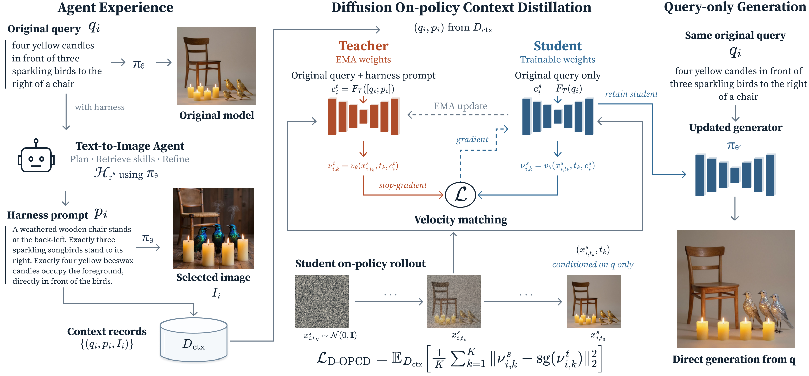
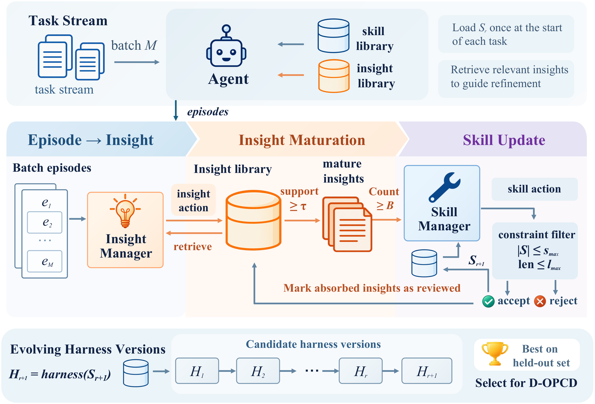

# Internalizing Agent Experience into Diffusion Model Weights via On-Policy Context Distillation

<p align="center">
  <a href="https://arxiv.org/abs/2610.07250"></a>
  <a href=""></a>
  <a href=""></a>
  <a href="https://github.com/Yummytanmo/D-OPCD-CoEvolution"></a>
</p>

<p align="center">
  <a href="#news">News</a> |
  <a href="#overview">Overview</a> |
  <a href="#installation">Installation</a> |
  <a href="#data-preparation">Data Preparation</a> |
  <a href="#agent-evolution">Agent Evolution</a> |
  <a href="#training">Training</a> |
  <a href="#evaluation">Evaluation</a> |
  <a href="#results">Results</a> |
  <a href="#citation">Citation</a>
</p>

## News

- **2026-10-07:** arXiv preprint is online: [https://arxiv.org/abs/2610.07250](https://arxiv.org/abs/2610.07250)

## Overview

This is the official implementation of **Diffusion On-Policy Context Distillation (D-OPCD)** and **Auto Skill Evolver (ASE)**.

<p align="center">
  <a href="assets/figures/method_overview.pdf">
    
  </a>
</p>

**Method overview.** D-OPCD transfers the gains conveyed by the Agent's prompts into the diffusion generator. An EMA teacher receives the original query and the matched Agent prompt, while the student receives only the original query. The student matches the teacher's predictions along its own denoising trajectories. After internalization, the harness resets its learned skills and evolves again around the updated generator.

### Framework Features

- **Agent experience internalization:** distill agent-selected prompts into diffusion model weights using on-policy context distillation.
- **Harness evolution:** learn reusable Memory and Skills from completed text-to-image tasks while the generator remains fixed.
- **Harness–model co-evolution:** alternate harness adaptation and generator training to support further improvement.
- **Baseline comparison:** implementations of Vanilla SFT, Diffusion-DPO, and D-OPSD alongside D-OPCD.
- **Benchmark evaluation:** GenEval, GenEval2, WISE Verified, and R2I-Bench, with T2I-CompBench++ for out-of-distribution evaluation.

## Repository Layout

- `agent/`: image-generation agent, verification, Memory, and Skill evolution.
- `runners/`: harness evolution, saved harness snapshots, and frozen evaluation.
- `configs/`: harness and generator configuration templates.
- [D-OPCD/](D-OPCD/README.md): diffusion training and method entry points.
  - `src/`: D-OPCD objective, dataset, and numerical trainers.
  - `train/`: training entry points for D-OPCD and the baselines.
  - [baselines/](D-OPCD/baselines/README.md): Vanilla SFT, Diffusion-DPO, and D-OPSD inputs and training.
  - [runners/](D-OPCD/runners/README.md): generation, validation-based checkpoint selection, and test evaluation.
  - [configs/](D-OPCD/configs/README.md): training task template and shared runtime settings.
  - [scripts/](D-OPCD/scripts/README.md): data conversion, inspection, and generation utilities.
- [evaluation/](evaluation/README.md): Agent feedback services, benchmark scoring, and OOD evaluation.
  - [data/](evaluation/data/README.md): task splits and benchmark annotations.
- [scripts/](scripts/README.md): Agent and generator launchers.
- `assets/figures/`: paper figures in PNG and PDF formats.
- [site/](site/README.md): static paper project page and GitHub Pages publishing.

## Installation

Use **Python 3.12**. Install the harness and trainer environments from the repository root:

```bash
uv sync --extra embedding --extra generator --extra evaluation
uv sync --project D-OPCD
```

The two projects have separate dependency sets and lockfiles. Supply the Z-Image-Turbo weights, a multimodal model endpoint, and the evaluator code and weights needed for your benchmarks. See [evaluation/README.md](evaluation/README.md) for feedback-service setup.

Create local configuration copies:

```bash
cp configs/evolution.example.json configs/evolution.local.json
cp evaluation/config.example.json evaluation/config.json
```

Set the following values for your environment:

- `manifests`, `run_id`, and `run_root`: task inputs and output location.
- `generator.url` and `generator.model`: generator endpoint and model identifier. For the supplied Z-Image launcher, use `http://127.0.0.1:8001/generate` and `Tongyi-MAI/Z-Image-Turbo`.
- `mllm.url`, `mllm.model`, and `mllm.api_key_env`: the Agent's multimodal model endpoint and credentials.
- `feedback.services`: feedback-service URLs for the benchmarks being used.
- `agent.max_iterations`, `evaluation.batch_size`, and `evaluation.workers`: task budget and concurrency.
- `memory` and `skill`: retrieval and evolution settings. Semantic Insight retrieval uses `BAAI/bge-m3`.

The supplied evolution template uses the GenEval ASE settings. For each benchmark, set
`skill.min_support`, `min_batches`, `min_mature_insights`, and
`min_batches_between_evolutions` as follows:

- GenEval: 2, 2, 3, and 4.
- GenEval2, WISE, and R2I-Bench: 4, 3, 8, and 6.

Keep API keys in environment variables or ignored local configuration files.

## Data Preparation

The paper uses **GenEval**, **GenEval2**, **WISE Verified**, and **R2I-Bench** for in-domain experiments, and **T2I-CompBench++** for OOD evaluation. Training, validation, and test tasks are separated; validation is used to select harness snapshots and generator checkpoints.

The Agent input splits are included in [evaluation/data/](evaluation/data/),
under `geneval/`, `geneval2/`, `wise/`, and `r2ibench/`. Each directory contains
`train.jsonl`, `validation.jsonl`, and `test.jsonl`. Set `manifests` to
`evaluation/data/<dataset>/train.jsonl` for Agent evolution. See
[evaluation/data/README.md](evaluation/data/README.md) for split sizes and record fields.

Harness task manifests use JSONL records containing `sample_id`, `benchmark`, and `prompt`, together with the benchmark metadata. GenEval2 requires `vqa_list` and `skills`; WISE requires `explanation`; R2I-Bench requires `checklist`.

After harness execution, `runs/<run-id>/contexts.jsonl` records the original query as `q` and the selected generation prompt as `p`. Prepare D-OPCD training pairs from this file:

```bash
uv run --project D-OPCD python D-OPCD/scripts/build_prompt_context_data.py \
  --input /path/to/agent-run/contexts.jsonl \
  --dataset geneval \
  --data-id my-context-pairs \
  --query-field q \
  --privileged-prompt-field p \
  --selection changed-only
```

This creates `D-OPCD/data/geneval/my-context-pairs/`. Replace `geneval` with the benchmark being used. D-OPCD trains on original-query and selected-prompt pairs; image-supervised baselines additionally require the selected images or chosen/rejected image pairs.

## Agent Evolution

### Auto Skill Evolver (ASE)

<p align="center">
  <a href="assets/figures/harness_evolution.pdf">
    
  </a>
</p>

ASE turns task experience into reusable prompt guidance through three levels:

- **Episode:** a completed task's execution trajectory and external evaluation feedback.
- **Insight:** guidance extracted from Episodes and refined through supporting or contradicting evidence across tasks.
- **Skill:** reusable instructions that combine mature Insights to construct the first generation prompt.

After each task batch, the Insight manager updates the Insight library. Once enough mature Insights accumulate, the Skill manager updates the bounded Skill library and marks absorbed Insights as reviewed. Each committed Skill update defines a harness version; validation selects the version whose query–prompt pairs are used for D-OPCD training.

### Running Agent Evolution

Start the local generator in a separate terminal:

```bash
Z_IMAGE_MODEL_PATH=/path/to/Z-Image-Turbo \
  bash scripts/generator/z-image.sh
```

Start the feedback service for your benchmark, as described in [evaluation/README.md](evaluation/README.md):

- GenEval: `evaluation.services.geneval_service`, default port `8101`.
- GenEval2: `evaluation.services.geneval2_service`, default port `8104`.
- WISE: `evaluation.services.wise_service`, default port `8105`.
- R2I-Bench: `evaluation.services.r2ibench_service`, default port `8108`.

Once the generator, multimodal model, and feedback services are available, run ASE on the configured training manifest:

```bash
bash scripts/experiment/train.sh configs/evolution.local.json
```

Tasks within a batch share the same harness state. Episodes are recorded after task completion; Memory and Skill updates are committed at the batch boundary and become available to later batches. The run saves generation artifacts, feedback, query–prompt pairs, and harness snapshots under `runs/<run-id>/`.

See [scripts/README.md](scripts/README.md) for the launchers.

## Training

From `D-OPCD/`, copy the training task template:

```bash
cd D-OPCD
cp configs/task.example.json configs/my-task.local.json
```

Set `dataset`, `selection`, `data_path`, `expected_count`, and `model_path` to match your prepared data. Configure the training budget, learning rate, LoRA settings, and checkpoint interval under `trainer_args`. Set the interpreter, process layout, and model path in `configs/runtime.json` for your training environment.

Check the configuration, then train D-OPCD:

```bash
uv run python train/dopcd.py \
  --config configs/my-task.local.json \
  --runtime-config configs/runtime.json

uv run python train/dopcd.py \
  --config configs/my-task.local.json \
  --runtime-config configs/runtime.json \
  --execute
```

The teacher receives the original query and the matched agent prompt; the student receives only the original query. The default task exposes the main parameters so they can be adjusted for a new dataset or training budget.

### Baselines

The baseline training entry points are:

- Vanilla SFT: `D-OPCD/train/sft.py`.
- Diffusion-DPO: `D-OPCD/train/flow_dpo.py`.
- D-OPSD: `D-OPCD/train/dopsd.py`.

The task configuration selects the method and its training data. From `D-OPCD/`, check the SFT inputs before training:

```bash
uv run python train/sft.py --config configs/my-sft.local.json --dry-run
```

D-OPSD uses Qwen3-VL to encode the original query and Agent-selected image as the EMA teacher condition. Its student follows its own sampling trajectory under the original query, with endpoint supervision. Use the dedicated D-OPSD task template; SFT and DPO use their image-supervised task templates.

See the [baseline guide](D-OPCD/baselines/README.md) for task preparation and commands, and the [configuration guide](D-OPCD/configs/README.md) for shared settings.

## Evaluation

### Frozen Harness Evaluation

Evaluate a saved harness snapshot from the repository root:

```bash
uv run python -m runners.evaluate_frozen \
  --config configs/evolution.local.json \
  --manifest /path/to/validation.jsonl \
  --variant full \
  --checkpoint latest
```

The available harness variants are `baseline`, `memory_only`, `skill_only`, and `full`. Frozen evaluation runs the Agent without updating its Memory or Skills. Use the selected snapshot and the test manifest for final evaluation.

### Generator Evaluation

`D-OPCD/runners/e2e.py` runs D-OPCD training, evaluates candidate checkpoints on validation data, and evaluates the selected checkpoint on the test split. Copy the E2E template and set the training configuration, checkpoint steps, split manifests, generation settings, and evaluator paths. See [D-OPCD/runners/README.md](D-OPCD/runners/README.md).

From `D-OPCD/`:

```bash
cp configs/e2e.example.json configs/my-experiment.local.json
uv run python runners/e2e.py --config configs/my-experiment.local.json
uv run python runners/e2e.py --config configs/my-experiment.local.json --execute
```

Benchmark scoring is under `evaluation/benchmarks/`. T2I-CompBench++ category evaluation is under `evaluation/ood/`. Evaluator code and model weights are installed separately; the [evaluation guide](evaluation/README.md) describes the adapters and services.

## Results

The main paper results are shown below. Scores are on a 0–100 scale; higher is better. **Avg.** is the unweighted mean across the four benchmarks.

| Generator and inference setting | GenEval | GenEval2 | WISE | R2I-Bench | Avg. |
| --- | ---: | ---: | ---: | ---: | ---: |
| Base generator, direct | 78.22 | 78.14 | 42.86 | 42.87 | 60.52 |
| Base generator + skill-free harness | 83.51 | 87.50 | 78.00 | 68.12 | 79.28 |
| Base generator + evolved skills | 87.63 | 88.83 | 81.43 | 69.41 | 81.83 |
| D-OPCD generator, direct | 81.28 | 82.24 | 50.00 | 46.83 | 65.09 |
| D-OPCD generator + skill-free harness | 86.08 | 88.41 | 81.14 | **73.68** | 82.33 |
| D-OPCD generator + newly evolved skills | **91.75** | **89.74** | **85.71** | 69.45 | **84.16** |

D-OPCD raises the average direct-generation score from **60.52 to 65.09**. A second ASE round on the updated generator improves the average from **82.33 to 84.16**.


## Acknowledgements

Our Agent scaffold builds on GEMS. We thank the authors of GenEval, GenEval2, WISE Verified, R2I-Bench, and T2I-CompBench++ for their benchmarks and evaluation implementations, and the Z-Image team for the base generator.

## Citation

If you find this work useful, please cite:

```bibtex
@misc{wang2026internalizingagentexperiencediffusion,
  title = {Internalizing Agent Experience into Diffusion Model Weights via On-Policy Context Distillation},
  author = {Wenxuan Wang and Zekai Liu and Weinan Zhang and Yu Cheng and Yang Yang},
  year = {2026},
  eprint = {2610.07250},
  archivePrefix = {arXiv},
  primaryClass = {cs.AI},
  url = {https://arxiv.org/abs/2610.07250}
}
```
